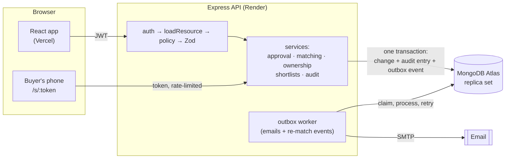

# Brokery CRM

[](https://github.com/AbhiEE03/Brokery-web/actions/workflows/ci.yml)

A role-based CRM for small real-estate brokerages: brokers manage their clients and property inventory, and changes to money-affecting fields (deal stage, budgets, asking price) go through an admin approval step instead of applying silently.

**Frontend:** https://brokery-ruddy.vercel.app  
**Backend API:** https://brokery-api.onrender.com

### Highlights

- **Maker-checker approvals that stay correct under concurrency:** each approval applies exactly once, with transactional stale-write detection. Tested with parallel approvals.
- **Tamper-evident audit log:** hash-chained entries written in the same transaction as each change, with a verify endpoint that pinpoints the first edited entry.
- **Client ownership protection:** a unique index on normalised phone numbers makes "who registered this buyer first" provable, even when two brokers submit at the same instant.
- **Object-level authorization:** one policy module and a table-driven test of every endpoint × role.
- **Explainable matching:** properties ranked for each client on budget, locality, size, bedrooms and freshness, each score with its reasons; top-k picked with a heap; an offline evaluation harness (precision@5, NDCG@10 against baselines).
- **Buyer shortlist links:** a broker shares one expiring link on WhatsApp; the buyer reacts without an account; tokens are stored only as hashes, and the public view is allow-listed.
- **Event-driven re-match alerts:** property changes and their events commit together (transactional outbox), and an idempotent worker alerts brokers when a change makes a listing fit one of their clients.
- **Measured performance:** 6–10× list and report queries on 100k synthetic clients after adding query-driven indexes (see [Performance](#performance)).
- **Team management:** admins add, deactivate and offboard brokers. Deactivation and password resets revoke sessions immediately, through a token version in each JWT. A leaving broker's clients move to someone else in one audited transaction, and the system never ends up without an active admin, even with two admins acting at once.
- **Tests and CI:** 229 backend tests against a real in-memory MongoDB replica set, 39 frontend tests and a browser end-to-end test, all run in CI on every pull request. API docs are generated from the same validators: [`/api/docs`](https://brokery-api.onrender.com/api/docs).

## Architecture



Every write that matters happens in **one transaction**: the change itself, its audit-log entry, any stage-history event, and any outbox event or notification. A background worker delivers side effects afterwards with retries, and every consumer is idempotent.

---

## Demo Credentials

| Role   | Email               | Password       |
| ------ | ------------------- | -------------- |
| Broker | shubham@brokery.com | Broker@Shubham |
| Broker | harshit@brokery.com | Broker@Harshit |
| Broker | naresh@brokery.com  | Broker@Naresh  |

> Admin credentials are not public. Request access directly if needed.

---

## Features

- **Roles & object-level authorization** — Admin and Broker. A single policy module decides who can read/update/upload/delete each resource: brokers only access their own clients and the matches involving them; property inventory is shared for reading but only the broker who listed a property (or an admin) can change it. Enforced by route middleware and covered by a table-driven authorization test.
- **Validated input** — every body and query is parsed with Zod; server-controlled fields (stage, status, codes) can't be set by clients.
- **Approval engine** — low-risk fields (phone, notes, locality…) update immediately; sensitive fields (pipeline stage, budget, city, asking price…) become a change request for admin review, for both clients and properties. Unchanged values are ignored, approval is transactional and exactly-once under concurrent clicks, and a request whose field changed in the meantime is flagged as a conflict instead of overwriting newer data. See [ADR 001](docs/adr/001-approval-engine.md).
- **Event-based analytics** — every stage change is recorded as a `StageTransition` event in the same transaction, so the dashboard shows closures by the month they actually happened, a pipeline funnel, median days in each stage, and broker conversion as closed ÷ (closed + lost). See [ADR 002](docs/adr/002-soft-delete-and-stage-history.md). History for clients that existed before stage tracking was added is backfilled as a single entry per client, so older funnel and time-in-stage figures are approximate.
- **Data lifecycle** — soft deletes with a transactional cascade (links removed, pending approvals closed), atomic sequence counters for client/property codes, versioned migrations in `backend/migrations`.
- **Client–property links** — brokers record which client is interested in which property and how strongly, and can change the interest level or remove a link.
- **Explainable matching** — each client gets its best-fitting available listings. Candidates come from one indexed query; each is scored on five features (budget, locality, size, bedrooms, freshness) with a reason per feature, e.g. "Price ₹94.5 L is 5% over the ₹90 L budget". A size-k heap picks the top results in O(n log k). Linking or dismissing a recommendation is recorded as feedback, and the reverse view ("interested clients") shows who a listing suits. See [ADR 004](docs/adr/004-matching-and-shortlists.md).
- **Buyer shortlist links** — brokers pick properties and send one expiring link (Share on WhatsApp). On a phone and without an account, the buyer taps *Love it*, *Book a visit* or *Not for me*, with an optional note. Reactions update the match's interest level, are audited, and alert the broker.
  - The 256-bit token is stored only as a SHA-256 hash.
  - Unknown, expired and revoked links all return the same 404.
  - The public response is allow-listed (no dealer contacts, notes or client details).
  - Rate-limited per IP and per link; reactions are idempotent.
- **Re-match alerts** — when a property is listed, or its price, status, size, bedrooms or location changes, the change and a `PropertyChanged` event commit together (transactional outbox). The worker scores candidate clients before and after the change and alerts the client's broker when the score **crosses** the match threshold (e.g. "Price dropped from ₹1.25 Cr to ₹95 L · 92% match"). A unique `(event, client)` index makes reprocessing harmless, and `/readyz` reports the age of the oldest unprocessed event. See [ADR 005](docs/adr/005-outbox-and-rematch.md).
- **Readable codes** — clients get `CL-000001`-style codes; properties get `00AA → 00AB → … → 01AA` codes, reserved from atomic counters so concurrent creates never collide.
- **Property search** — relevance-ranked full-text search on title and locality (text index), falling back to substring matching for partial words and property codes.
- **Tamper-evident audit log** — every change, upload, approval decision, account event and login is recorded with before/after values, the actor and the request id, inside the same transaction as the change. Entries are hash-chained (`sha256(prevHash + entry)`), and `GET /api/activity/verify` pinpoints the first edited or missing entry. Filterable by entity, broker and date, with keyset pagination. See [ADR 003](docs/adr/003-audit-log-and-ownership.md).
- **Client ownership protection** — phone numbers are normalised (`098765 43210` = `+91-98765-43210`) and unique among live clients via a database index, so two brokers can't both register the same buyer, even at the same instant. The second broker learns only that the client exists; an ownership claim goes to the admin with the audit entry proving who registered first, and the admin keeps or transfers the client.
- **Uploads** — client documents (PDF/images) and property images are stored on Cloudinary; file types are verified by content signature, 5 MB limit.
- **Reliable notifications** — approval outcomes are written to a transactional outbox and emailed by a background worker with retries and exponential backoff, so SMTP problems never block or roll back an approval.
- **Frontend** — React 19 + React Query, with patterns borrowed from tools brokers already know:
  - **Pipeline board** (Pipedrive-style): drag a client to another stage; brokers' moves become approval requests and show as "awaiting approval" on the card. Each card also has a keyboard-accessible "Move to" menu.
  - **Ctrl+K command palette** (Linear-style): jump to any client, property or page.
  - **Listing-style property cards**: photo, ₹ L/Cr price with ₹/sq ft, BHK and area chips, status ribbon.
  - **Recommendations** with match-percentage badges and expandable score breakdowns; a notification bell for new matches and buyer reactions; toasts; search-as-you-type pickers.
  - Role-aware routing: brokers land on their clients, and admin screens are guarded.
  - An expired session signs the user out.
  - Edit forms send only the fields you changed and show which of them will need approval *before* you save, using rules from `GET /api/meta/edit-policies` rather than copies in the UI.
  - Each client and property shows its history from the audit log.
  - The approval queue has Pending / Conflicts / History tabs, with a side-by-side "requester saw → now → requested" view for conflicts.
  - Accessible confirmation dialogs; prices shown in ₹ lakh/crore.
- **Team management** — an admin-only Team page (`/team`):
  - Add a broker or admin. Leave the password blank to get a strong generated one, shown once.
  - Reset a password. This bumps the user's `tokenVersion`, so every existing session ends at once.
  - Deactivate (effective on the next request) or reactivate.
  - Offboarding moves all of a broker's clients to another active broker in one audited transaction.
  - You can't deactivate yourself or the last active admin. A shared roster write makes concurrent deactivations conflict, so write skew can't leave zero admins.

  See [ADR 006](docs/adr/006-team-management.md).
- **Public landing page & SEO** — the landing page is pre-rendered to static HTML at build time and hydrated by React, so search engines and link previews (WhatsApp, LinkedIn) see real content without running JavaScript.
  - **Search and previews:** meta description, canonical URL, Open Graph and Twitter cards with a 1200×630 preview image, and JSON-LD structured data.
  - **Crawl control:** `robots.txt` and `sitemap.xml`. App routes and buyer shortlist links are served from separate `noindex` shells.
  - **Performance:** route-level code splitting (895 KB → 301 KB main bundle), responsive images and long-lived caching for hashed assets.
  - **Lighthouse:** 99–100 on performance, accessibility, best practices and SEO (mobile and desktop, measured on a production build).
- **Operational basics** — structured JSON logs with request IDs, consistent JSON error responses, Helmet security headers, per-IP API rate limits and per-account login throttling, `/healthz` and `/readyz` probes, env validation at boot, graceful shutdown.

## Performance

`npm run bench` (in `backend/`) generates a synthetic dataset (100k clients, 30k properties, 50k matches, 100k activity entries) in an in-memory replica set, then measures each endpoint with and without the schema indexes. Latest run, p50 latency ([full table and machine details](backend/bench/results/2026-09-29.md)):

| Endpoint | No indexes | Indexed |
|---|---:|---:|
| Broker's client list | 202 ms | 30 ms |
| Clients by stage (admin) | 239 ms | 45 ms |
| Property search (text index vs substring scan) | 171 ms | 27 ms |
| Closures by month | 245 ms | 26 ms |
| Activity feed, 40k rows deep: offset / keyset | 408 / 203 ms | 89 / 52 ms |
| Dashboard summary (full-collection aggregation) | 161 ms | 167 ms |

Single laptop run with the database on the same machine; read it as before/after, not as production capacity. Full-collection aggregations don't benefit from indexes. Pre-aggregating them is the next step (see `docs/ENGINEERING_LOG.md`).

## Matching evaluation

Matching quality is measured offline against human judgement:

```bash
cd backend
npm run match:export   # 30 clients × 15 same-city properties, random order, no personal data
# grade each row of bench/matching/labels.csv: 0 = not relevant, 1 = maybe, 2 = strong fit
npm run match:eval     # precision@5 and NDCG@10 on held-out clients vs random and price-only baselines
```

No evaluation numbers are published yet: the labels have to come from a person grading real pairs.

## Known limitations

- **Audit chain:** it proves integrity against edits, not against someone rewriting the whole database from a point onwards. Publishing the chain head periodically would close that gap.
- **Audit write throughput:** writes are serialised through one counter document. That's fine at CRM volumes; chaining per entity would scale further.
- **Matching:** weights are hand-set until labelled data exists, and freshness favours new listings.
- **Pipeline board:** it loads up to 100 clients at once. The list view pages through everything.
- **Dashboard totals:** they're full-collection aggregations (~160 ms at 100k clients) and aren't pre-computed yet.
- **Ownership protection:** it's per phone number. A buyer using two numbers can still be registered twice.
- **Login token:** it's kept in `localStorage`. React escapes output and no raw HTML is rendered, but an httpOnly cookie would be stronger.
- **No real usage yet:** the benchmark numbers are from a laptop, and there are no production usage metrics.

---

## Tech Stack

**Frontend:** React 19, React Query, Redux Toolkit, React Router, Axios, Tailwind CSS, Recharts, Vite  
**Backend:** Node.js, Express 5, MongoDB (transactions on a replica set), Mongoose, Zod, JWT, pino, Helmet, Nodemailer, Cloudinary, migrate-mongo  
**Testing:** Jest + Supertest + mongodb-memory-server, Vitest + React Testing Library, Playwright, autocannon (benchmarks)  
**Infra:** GitHub Actions (CI), Render (backend), Vercel (frontend), MongoDB Atlas

## Project structure

```text
backend/
  app.js, server.js       Express app (importable by tests) and process entry point
  routes/ controllers/    HTTP layer: loadResource → authorize → validate → handler
  services/               approval engine, audit log, ownership claims, lifecycle, notifications
  policies/               who can do what, in one place
  validation/             Zod schemas for every body and query
  models/                 Mongoose schemas (soft delete plugin, indexes)
  migrations/             versioned, idempotent data migrations
  workers/                outbox worker that sends notification emails
  openapi/                route table → OpenAPI 3.1 (served at /api/docs)
  tests/                  Jest suites, including the authorization matrix and concurrency tests
  bench/                  synthetic data + autocannon benchmark
frontend/
  src/pages/              screens (clients, properties, approvals, claims, dashboard…)
  src/hooks/queries.js    React Query hooks per resource
  e2e/                    Playwright end-to-end test
docs/
  adr/                    design decisions (approval engine, soft delete & stage history, audit & ownership, matching & shortlists, outbox & re-match, team management)
  ENGINEERING_LOG.md      bugs found, how they were found, how they were fixed
```

## Design docs

- [ADR 001 — Approval engine](docs/adr/001-approval-engine.md): exactly-once approvals, stale detection, transactional outbox
- [ADR 002 — Soft delete, stage history and atomic codes](docs/adr/002-soft-delete-and-stage-history.md)
- [ADR 003 — Audit log and ownership protection](docs/adr/003-audit-log-and-ownership.md)
- [ADR 004 — Matching and buyer shortlist links](docs/adr/004-matching-and-shortlists.md)
- [ADR 005 — Transactional outbox and re-match alerts](docs/adr/005-outbox-and-rematch.md)
- [ADR 006 — Team management: revoking sessions and offboarding](docs/adr/006-team-management.md)
- [Engineering log](docs/ENGINEERING_LOG.md): the authorization holes, race conditions and UI bugs found, and how each was fixed and tested

---

## Local Setup

```bash
# Clone the repo
git clone https://github.com/AbhiEE03/Brokery-web.git
cd Brokery-web

# Backend
cd backend
cp .env.example .env
# Fill in your values in .env
npm install
npm run dev

# Frontend (new terminal)
cd frontend
cp .env.example .env
# Set VITE_API_URL=http://localhost:5000/api
npm install
npm run dev
```

Frontend runs on `http://localhost:5173`, backend on `http://localhost:5000`.

### Sandbox mode (no database setup needed)

```bash
cd backend
npm run dev:sandbox
```

Starts the API on `http://localhost:5000` against a throwaway in-memory MongoDB replica set, seeded with demo data. Uploads go to `backend/.dev-uploads/` and emails are logged instead of sent. It never touches the database configured in `.env`.

### Tests

CI (GitHub Actions) runs three jobs on every pull request and every push to `main`:
- **backend:** 229 Jest tests, including the authorization matrix, parallel-approval races, audit-chain tamper detection, simultaneous duplicate registrations, shortlist-link security, idempotent re-match alerts, and session revocation plus the last-admin race.
- **frontend:** lint, 39 Vitest tests and a production build.
- **e2e:** a Playwright test of the core flow in a real browser.

```bash
cd backend && npm test    # Jest + Supertest against an in-memory MongoDB replica set
cd frontend && npm test   # Vitest + React Testing Library
cd frontend && npm run e2e   # Playwright: broker proposes → admin approves → broker sees it
                             # (starts the sandbox API + Vite; set PW_CHANNEL=msedge or chrome to use an installed browser)
```

### Using a real MongoDB

The approval engine uses multi-document transactions, which need a **replica set**. MongoDB Atlas clusters already are one. For a local `mongod`, start it once as a single-node replica set:

```bash
mongod --replSet rs0 --dbpath ./data
mongosh --eval "rs.initiate()"
# MONGO_URI=mongodb://localhost:27017/brokery?replicaSet=rs0
```

Schema changes ship as migrations (`backend/migrations`, run with `npm run migrate:up` after a backup).

### Seeding a real database

Seed a **development** database with demo data (wipes existing data; refuses to run with `NODE_ENV=production`):

```bash
cd backend
ADMIN_PASSWORD='<choose one>' node scripts/seed.js
```
